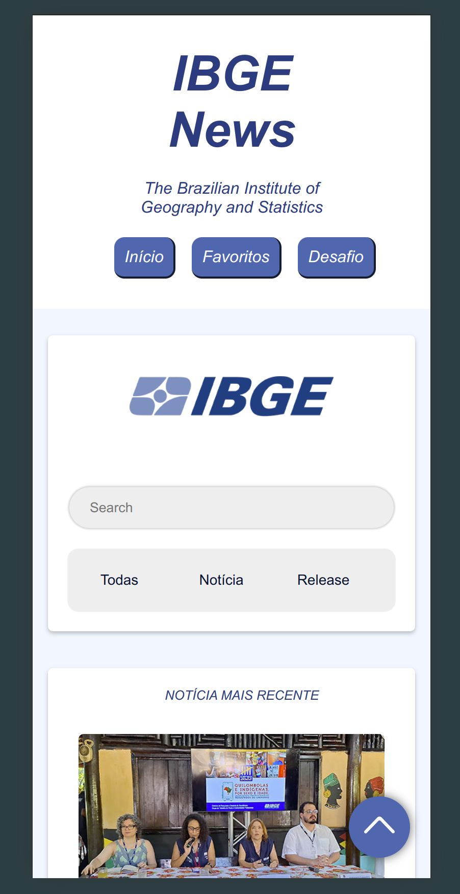

# Desafio React + TypeScript + Vite + CSS + vitest.

Desenvolver uma aplicação que consuma a API de notícias do IBGE
e exiba as notícias em uma lista. Cada item da lista deve ter um
botão de favoritar. Ao clicar no botão de favoritar, a notícia
deve ser salva no localStorage e o botão deve mudar de cor para
indicar que a notícia foi favoritada. A aplicação deve ter uma
página de favoritos que exibe as notícias favoritadas.

## Aprendizados

A sair da mentalidade de aluno em um treinamento, para perceber o que é necessário estar da melhor forma, para o usuário e para outros desenvolvedores. Além de aprimorar nas tecnologias e ferramentas de desenvolvimento aos testes.

### Fornecedor da API
- [Site do IBGE](https://www.ibge.gov.br/).

### Fontes dos icones
- [Vectors and icons by svgrepo!](https://www.svgrepo.com) 

# Projeto em funcionamento
Link de acesso a Página do projeto funcionando.
- [Acessar o site!](https://desafiofront-trybe-andrebg.surge.sh/) 

## Construir o projeto na sua maquina.

- Clone o projeto.
- Rode o comando `npm install` para instalar as dependencias.
- Rode o comando `npm run dev` para inicializar o projeto.
- Rode o comando `npm run coverage` para iniciar os testes de cobertura.


### Executando Testes

  1. Executar apenas os testes:
      ```bash
      npm run test
      ```

  2. Conferir a cobertura dos testes:
      ```bash
      npm run test:coverage
      ```
*⚠️ Para conseguir executar os testes, é necessário que o servidor esteja rodando junto, basta seguir os passos para executar o projeto localmente: `npm run start` ou `npm run compose:up` se tiver o Docker e Docker Compose instalados*


### Executando ESLint e Stylelint

Este projeto possui ESLint configurado e com scripts para executá-los, use os seguintes comandos:


  1. Executar ESLint e Stylelint:
      ```bash
      npm run lint
      npm run lint:styles
      ```

*⚠️ Para conseguir executar os linters, é necessário que as dependências estejam instaladas, basta seguir os passos para executar o projeto localmente: `npm run start` ou `npm run compose:up` se tiver o Docker e Docker Compose instalados*

## Screenshots


&nbsp;&nbsp;&nbsp;&nbsp;&nbsp;&nbsp;&nbsp;&nbsp;&nbsp;&nbsp;&nbsp;


## Estrutura do projeto

  ```css
  src/
  │
  ├── assets/
  │   ├── ArrowUp.svg
  │   ├── FavoriteNo.svg
  │   ├── FavoriteYes.svg
  │   ├── github.svg
  │   ├── linkedin.svg
  │   ├── react.svg
  │
  ├── components/
  │   ├── BtnFavorite/        
  │   ├── BtnTop/
  │   ├── CardDestaque/
  │   ├── CardNews/
  │   ├── Filter/
  │   ├── Footer/
  │   ├── Header/
  │   ├── Menu/
  │   ├── Search/
  │
  ├── context/
  │   ├── IBGEContext.ts
  │   ├── IBGEProvider.tsx
  │
  ├── hooks/
  │   ├── useFetch.tsx
  │   ├── useLocalStorage.tsx
  │
  ├── pages/
  │   ├── Desafio/    
  │   ├── Favorites/
  │   ├── Home/
  │   ├── Layout/
  │   ├── not-found/
  │
  ├── services/
  │   ├── api.tsx
  │
  ├── tests/
  │   ├── helpers/
  │   ├── mocks/
  │   ├── App.test.tsx
  │
  ├── types/
  │   ├── index.tsx
  │
  ├── App.tsx
  │
  ├── index.css 
  │
  ├── main.tsx 
  │
  ├── vite-env.d.ts